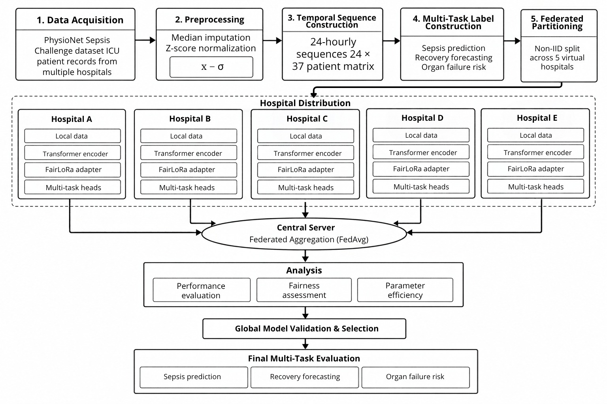

# FairLoRA-Enabled Federated Multi-Task Learning for Sepsis

This repository provides the implementation of the proposed **FairLoRA-Enabled Federated Multi-Task Learning Framework for Sepsis**. The framework combines Transformer-based temporal modeling, FairLoRA adaptation, federated learning, demographic fairness, and multi-task prediction for privacy-preserving sepsis management.

## Framework Overview

<p align="center">
  
</p>

The proposed framework processes longitudinal ICU records as **24 × 37 temporal clinical sequences**. Missing values are handled using median imputation, followed by Z-score normalization. A Transformer Encoder captures temporal dependencies, while FairLoRA provides parameter-efficient adaptation during federated optimization.

The framework jointly performs three clinical tasks:

- Sepsis prediction
- Recovery outcome forecasting
- Organ failure risk assessment

## Dataset

Experiments are conducted using the **PhysioNet/Computing in Cardiology Challenge 2019 Sepsis dataset**.

Official dataset:

https://physionet.org/content/challenge-2019/1.0.0/

A total of **37 clinical variables** covering vital signs, laboratory measurements, demographic information, and hospitalization variables are used.

The original `SepsisLabel` is used for sepsis prediction. Recovery and organ-risk targets are derived from the available longitudinal measurements.

Recovery classes are defined using the maximum ICULOS value:

- Class 0: ICULOS ≤ 29 hours
- Class 1: 29 < ICULOS ≤ 44 hours
- Class 2: ICULOS > 44 hours

Organ-risk labels are derived as:

- Kidney: Creatinine > 2.0 or BUN > 40.0
- Respiratory: O2Sat < 90.0 or Resp > 30.0
- Cardiovascular: MAP < 65.0 or SBP < 90.0

## Federated Learning Setup

Five non-IID virtual hospitals are constructed to represent heterogeneous demographic populations:

| Hospital | Dominant Population |
|---|---|
| A | Young |
| B | Adult |
| C | Elderly |
| D | Female |
| E | Male |

The hospitals collaboratively train the model using **Federated Averaging (FedAvg)** while keeping raw patient records local.

## Experimental Configuration

| Parameter | Setting |
|---|---|
| Dataset | PhysioNet Sepsis Challenge 2019 |
| Input | 24 × 37 |
| Hospitals | 5 |
| Temporal Model | Transformer Encoder |
| Adaptation | FairLoRA |
| Tasks | 3 |
| Communication Rounds | 10 |
| Local Epochs | 30 |
| Batch Size | 128 |
| Optimizer | AdamW |
| Scheduler | Cosine Annealing |

Fairness is evaluated using **Demographic Parity Difference (DPD), Equal Opportunity Difference (EOD), and FPR Gap** across age and gender groups.

## Repository Structure

```text
.
├── README.md
├── methodology.png
├── dataset_preprocessing.py
├── methodology_training.py
└── evaluation_results.py
```

`dataset_preprocessing.py` handles dataset preparation, preprocessing, temporal sequence construction, derived clinical labels, and federated hospital partitioning.

`methodology_training.py` implements the Transformer-FairLoRA multi-task architecture and federated training procedure.

`evaluation_results.py` performs predictive, multi-task, demographic fairness, cross-hospital, and parameter-efficiency evaluation.

## Installation

```bash
pip install numpy pandas scipy scikit-learn tqdm torch matplotlib
```

## Run

Execute the files in the following order:

```bash
python dataset_preprocessing.py
python methodology_training.py
python evaluation_results.py
```

## Reported Performance

| Metric | Result |
|---|---:|
| Accuracy | 93.26% |
| AUROC | 0.824 |
| AUPRC | 0.978 |
| Precision | 0.882 |
| Recall | 0.915 |
| F1-Score | 0.898 |

FairLoRA reduces the number of trainable parameters from **1,216,135 to 123,271**, corresponding to an **89.86% reduction**.

## Research Use

This repository is intended for academic research and reproducibility. It is not intended for direct clinical diagnosis or treatment decisions.

## Citation

If you use this implementation, please cite:

**FairLoRA-Enabled Federated Multi-Task Learning Framework for Sepsis**# sepsis-
